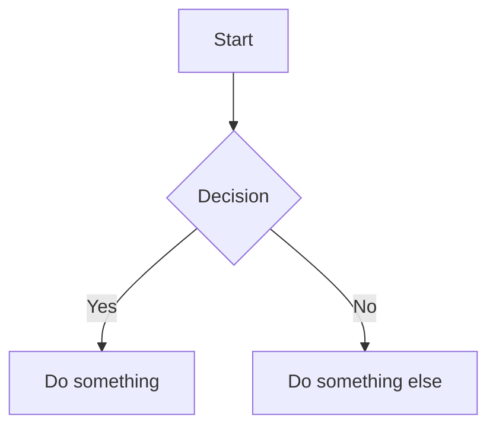

# AxX-ZQ-PL Documentation

> Documentation site for the **AxX-ZQ-PL** project, built with [MkDocs](https://www.mkdocs.org/) and the [Material theme](https://squidfunk.github.io/mkdocs-material/).

---

## Table of Contents

- [Prerequisites](#prerequisites)
- [Installation](#installation)
- [Project Structure](#project-structure)
- [Build & Serve](#build--serve)
- [Configuration Overview](#configuration-overview)
- [Contributing](#contributing)

---

## Prerequisites

- **Python** 3.8 or higher
- **pip** (comes bundled with Python)
- Recommended: a virtual environment (`venv` or `conda`)

---

## Environment setup

### 1. Create and activate a virtual environment

```bash
python -m venv .venv

# Linux / macOS
source .venv/bin/activate

# Windows (PowerShell)
.venv\Scripts\Activate.ps1
```

### 2. Install Python dependencies

```bash
pip install -r requirements.txt
```

#### `requirements.txt`

```
mkdocs>=1.5.0
mkdocs-material>=9.0.0
mkdocs-mermaid2-plugin>=1.1.0
mkdocs-print-site-plugin>=2.3.0
pymdown-extensions>=10.0
```

> **Tip:** Pin exact versions for reproducible builds:
> ```bash
> pip freeze > requirements.txt
> ```

---

## Project Structure

```
/
│
├── docs/                        # All Markdown source files
│   ├── index.md                 # Home page
│   ├── img/                     # Image assets
│   ├── pages/                   # Documentation pages
│   │   ├── page_1.md
│   │   └── page_2.md
│   └── stylesheets/
│       └── extra.css            # Custom CSS overrides
│
├── site/                        # Generated static site (git-ignored)
│
├── mkdocs.yml                   # MkDocs configuration file
├── requirements.txt             # Python dependencies
└── README.md                    # This file
```

> The `site/` directory is auto-generated during the build. Add it to your `.gitignore`:
> ```
> site/
> ```

---

## Build & Serve

### Live preview (development server)

Starts a local server with hot-reload at `http://127.0.0.1:8000`:

```bash
mkdocs serve
```

### Production build

Outputs the static site into the `site/` directory:

```bash
mkdocs build
```

### Build with strict mode (recommended for CI)

Treats warnings as errors to catch broken links and missing references:

```bash
mkdocs build --strict
```

### Clean build

Removes the previous `site/` output before rebuilding:

```bash
mkdocs build --clean
```

### Visual Studio Code tasks automation

Add tasks automation in `.vscode/tasks.json`

    MkDocs Build
    MkDocs Clean
    MkDocs Serve

---

## Configuration Overview

The `mkdocs.yml` file controls the entire site. Key settings:

| Setting | Value | Description |
|---|---|---|
| `theme.name` | `material` | Material for MkDocs theme |
| `theme.language` | `en` | UI language |
| `plugins` | `search`, `mermaid2`, `print-site` | Active plugins |
| `extra_css` | `stylesheets/extra.css` | Custom stylesheet |

### Active Features

- 🔍 **Search** — suggestions, highlighting, and shareable links
- 🔝 **Back to top** button
- 📌 **TOC follow** — table of contents tracks scroll position
- 📊 **Mermaid diagrams** — native diagram rendering via fenced code blocks
- 🖨️ **Print-site** — generates a single printable/PDF-friendly page

### Mermaid diagram example

Use fenced code blocks with the `mermaid` language tag in any Markdown file:

````markdown

````

[Mermaid Cheet Sheet](https://jojozhuang.github.io/tutorial/mermaid-cheat-sheet/)

---

## Contributing

1. Add or edit Markdown documentation files under `docs/pages/`
2. Add new files in `docs/index.md`
3. Update `Nav` section in `mkdocs.yml`
4. Preview changes locally with `mkdocs serve`
5. Commit

---
