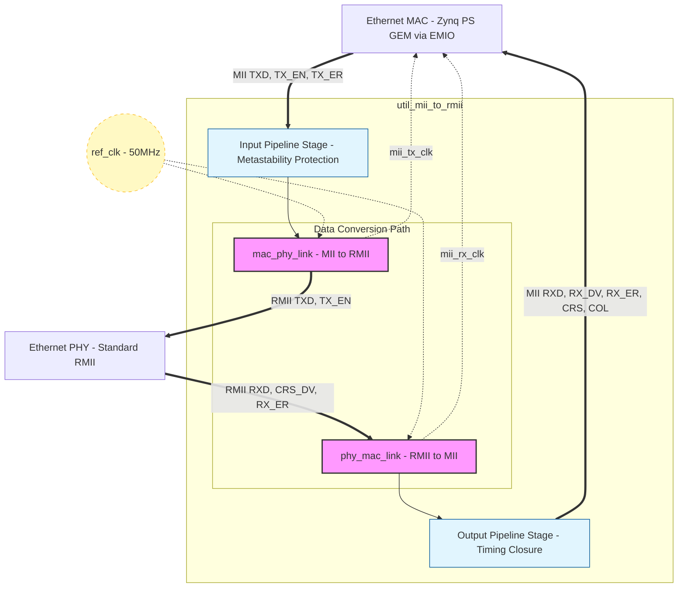
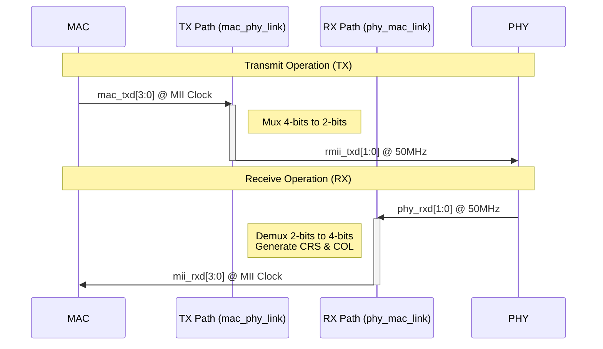

# Ethernet Interface

- [Ethernet Interface](#ethernet-interface)
    - [MII to RMII conversion](#mii-to-rmii-conversion)
        - [Top-Level Architecture](#top-level-architecture)
        - [Key Modules](#key-modules)
            - [1. `mac_phy_link` (TX Datapath)](#1-mac_phy_link-tx-datapath)
            - [2. `phy_mac_link` (RX Datapath)](#2-phy_mac_link-rx-datapath)
        - [Data Flow Diagram](#data-flow-diagram)
        - [Configuration Parameters](#configuration-parameters)
        - [Clocking Architecture](#clocking-architecture)
    - [Hardware Implementation](#hardware-implementation)
        - [Control Interface](#control-interface)
        - [Software Registers Interface](#software-registers-interface)

## MII to RMII conversion

The `util_mii_to_rmii` is a bridging module that converts Media Independent Interface (MII) signals to Reduced Media Independent Interface (RMII) signals, and vice versa. It sits between an Ethernet MAC (which uses MII or GMII) and an Ethernet PHY (which uses RMII).

From an architectural standpoint, the module bridges a 4-bit MII data path to a 2-bit RMII data path. Since RMII operates at twice the clock frequency (50 MHz) of MII (25 MHz for 100 Mbps), the core handles the multiplexing, demultiplexing, and clock domain synchronization required between these two standards.

### Top-Level Architecture

The module is structured into a top-level wrapper with input/output registering for timing closure, and two main submodules handling the independent Transmit (TX) and Receive (RX) datapaths.

### Key Modules

#### 1. `mac_phy_link` (TX Datapath)

This module bridges the MAC transmission to the PHY.

* **Role:** Multiplexes the 4-bit MII transmit data (`mac_txd[3:0]`) into 2-bit RMII transmit data (`rmii_txd[1:0]`).

* **Clocking:** Derives the `mii_tx_clk` from the 50MHz `ref_clk`. Depending on the speed configuration, it manages the sampling phase to grab 4 bits on the MII clock edge and push out 2 bits on successive RMII clock edges.

#### 2. `phy_mac_link` (RX Datapath)

This module bridges the PHY reception to the MAC.

* **Role:** Demultiplexes the incoming 2-bit RMII receive data (`phy_rxd[1:0]`) into 4-bit MII receive data (`mii_rxd[3:0]`).

* **Control Signaling:** It synthesizes standard MII control signals like `mii_crs` (Carrier Sense), `mii_col` (Collision), and `mii_rx_dv` (Data Valid) based on the RMII `phy_crs_dv` signal and the detection of packet boundaries (Start of Packet/End of Packet logic).

### Data Flow Diagram

### Configuration Parameters

The module behavior is governed by two main synthesis parameters:

1. **`INTF_CFG` (Interface Selection)**

   * `0`: Standard MII Interface

   * `1`: GMII Interface

2. **`RATE_10_100` (Speed Rate Selection)**

   * `0` (100 Mbps): Clock divider operates at a ratio matching 100 Mbps (25 MHz MII clocks generated from 50 MHz ref_clk).

   * `1` (10 Mbps): Clock divider operates at a ratio matching 10 Mbps (2.5 MHz MII clocks generated from 50 MHz ref_clk).

### Clocking Architecture

The entire module operates synchronously to the external `ref_clk` (typically a 50 MHz oscillator required by the RMII spec).

* The internal logic runs on the 50 MHz `ref_clk`.

* `mii_tx_clk` and `mii_rx_clk` are synthesized internally via clock dividers (div-by-2 for 100Mbps, div-by-20 for 10Mbps) and are driven out to the MAC interface.

* All inputs from the MAC and PHY are passed through a dual-stage register pipeline to ensure metastability protection and predictable timing closure at the device boundaries.

## Hardware Implementation

An instance for the Ethernet Interface is implemented in the top module of the PL `top_zynq.v` and is enabled by `HW_ETH` macro.

The `util_mii_to_rmii` module instance connects the **GMII** interface of the **Processing System IP** (PS) to the output PL PINs, connected to the PHY device. The instance is configured as a **100Mbps MII** interface.

    util_mii_to_rmii #(
        .INTF_CFG(0),       // MII
        .RATE_10_100(0)     // 100Mbps

### Control Interface

* The **MDIO** control interface is directly connected to the **PS**
* The **Reset** PIN of the PHY is connected to a dedicated EMIO PIN.

### Software Registers Interface

The Gigabit Ethernet Controllers (**GEM**) is managed through the Xilinx API driver [`emacps`](https://xilinx.github.io/embeddedsw.github.io/emacps/doc/html/api/index.html).
